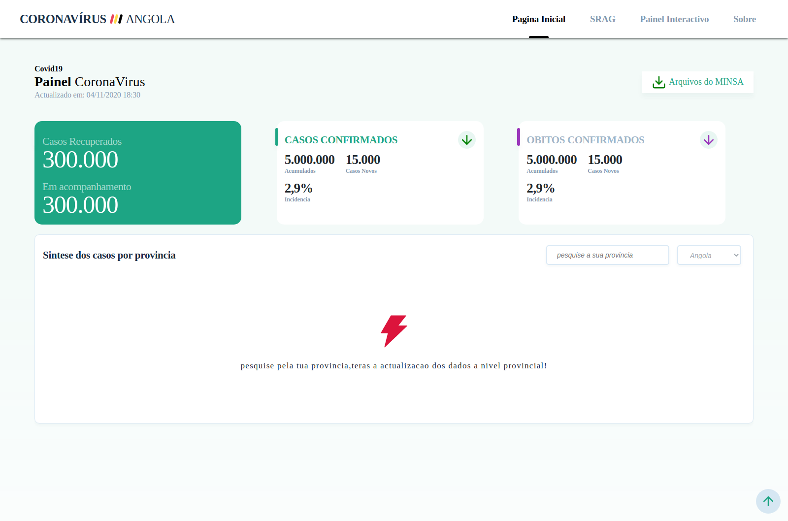

# Covid19 ao api

Este é um projeto opensource que visa de uma forma actualizado informar os casos da convid19 em Angola, o usuário pode fazer pesquisa por provincias e visualizar os dados da referida provincia.

# Como configura na sua máquina

1. Faça o fork do projecto
2. Clona na sua máquina a tua copia do projecto
3. de acordo com a estrutura do projecto temos os directorios src (código actual da api) e temos o directório web (código actual do frontend), para os dois directorio instalas as dependencias, usando o seguinte comando `yarn install`, lembrando que isto é para os dois repositórios. tenha certeza que na sua máquina tens o NodeJs configurando e o mongodb.

# Como contribuir

Se seguites o passo de como redar na sua máquina já estas pronto para contribuir, caso contrário siga a secçao de como configurar na sua máquina.

Se já tens o projecto a rodar na sua máquina, criar uma brench com o nome da feature que estas a desenvolver, depois de terminada faça um PR e aguarda aprovação do seu PR.

# O que contribuir

Abaixo estaremos listando algumas sugestões:

- [ ] Restruturar os directórios separando em backend e frontend
- [ ] Por em produção usando o heroku.com e mongodb.com
- [ ] Configurar o docker para desenvolvimento (para evitar que os devs tenhas que instalar ferramentas em suas maquinas local ex: mongodb)
- [ ] (tambem podes por aqui a sua sugestão)
